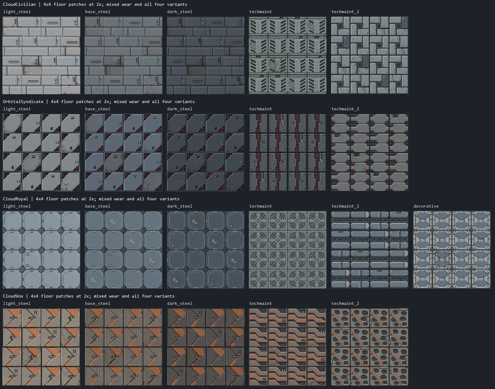
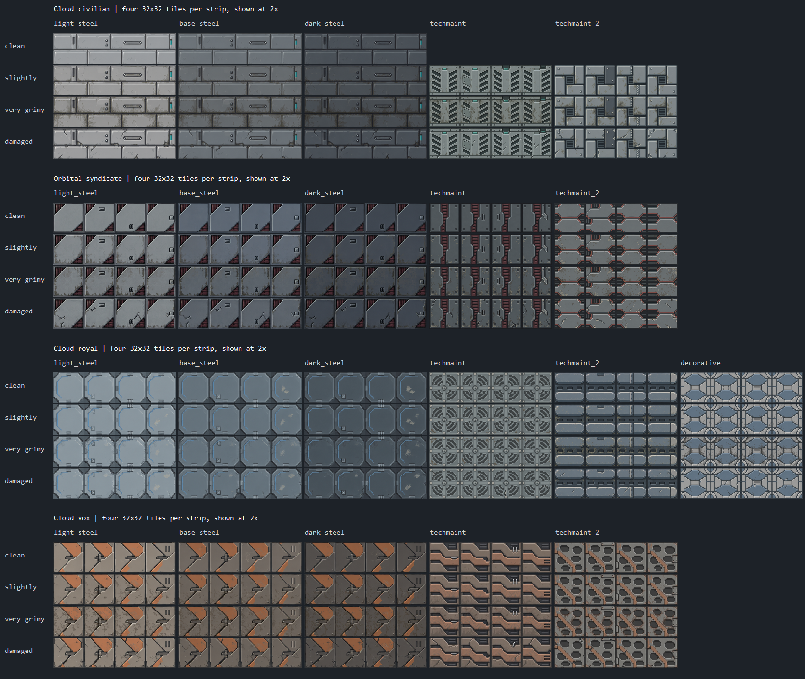

# Artbook floor sets — revision 4

This revision uses the original Orbital tiles as a reference for pixel scale, shading, detail density and saturation, not as a shape template. The four factions use different floor constructions. Light, base and dark steel remain three shades of **one shared construction per faction**.

78 condition sheets were replaced. The four Cloud royal `techmaint` sheets (the first maintenance family, with curved fans) are preserved **byte-for-byte**, along with all original Orbital textures.

## Designs

| Faction | Shared steel construction | Techmaint 1 | Techmaint 2 | Decorative |
| --- | --- | --- | --- | --- |
| Cloud civilian | Broad staggered service slabs | Opposed-louver walking spine | Interlocking access plates around a recessed grille | — |
| Orbital syndicate | Square cover with two opposite diagonally clipped corners, exposing recessed ribs | Offset armor shutters over a burgundy service channel | Staggered hexagonal service pads | — |
| Cloud royal | Connected octagonal slabs and small connector keys | **Preserved curved-fan pattern** | Rounded service runners with oval drains | Lozenge-and-ring mosaic |
| Cloud vox | Interlocking beak-shaped plates | Hooked tread ribs over recesses | Large punched openings and a supporting strap | — |

The syndicate steel follows the requested clipped-corner step surface over machinery. Faction identity also uses muted departmental accents, gunmetal/burgundy, dusty blue-gray, or warm salvaged metal with faded clay-orange paint. Four variants differ through access fittings, replacement sections, repairs and wear while retaining the family construction.

## Exported previews



Each patch mixes all four variants with mostly intact/lightly worn cells, one heavily grimy cell and one damaged cell.



| Set | Condition sheets | Individual 32x32 frames |
| --- | ---: | ---: |
| Cloud civilian | 18 | 72 |
| Orbital syndicate | 20 | 80 |
| Cloud royal | 24 | 96 |
| Cloud vox | 20 | 80 |
| Total | 82 | 328 |

Every runtime PNG is exactly **128x32**, with four opaque **32x32** frames horizontally and no padding. Conditions are separate files: `clean`, `slightly_grimy`, `very_grimy`, `damaged`. Cloud civilian maintenance intentionally has only the three worn conditions requested by the Artbook.

Runtime assets live in `Resources/Textures/_KS14/Tiles/{CloudCivilian,OrbitalSyndicate,CloudRoyal,CloudVox}/`. Preview images are documentation, not runtime textures.

## Preservation and registration

The first Cloud royal maintenance family was excluded from regeneration. The manifest contains its four SHA-256 hashes and a `preserveExisting` flag. Both exporter and validator check those hashes. The exporter skips these files even with `-Force`.

All 82 mapper-tile prototype IDs and four equal placement weights remain stable in `Resources/Prototypes/_KS14/Tiles/`. Locale names were updated to reflect the new constructions. No maps, craftable tile-stack entities or gameplay code were changed.

## Artwork and reproduction

The imagegen skill's **built-in image tool** generated the artwork using reference boards assembled from the actual original Orbital sprites and existing SS14 pavement, herringbone, maintenance, reinforced and xeno floors. The new shapes were specified separately from the rendering style. The two Vox maintenance paint palettes received targeted saturation corrections without a geometry redesign.

The [selected prompt manifest](../../../../Tools/_KS14/Tiles/faction-atlases.json) records source filenames, exact prompts, palette-edit parent prompts and crop bounds. The [revision brief](../../../../Tools/_KS14/Tiles/artbook-revision-plan.json) records the design instructions and pre-edit protection hashes; the [source log](../../../../Tools/_KS14/Tiles/artbook-revision-sources.json) records the twelve selected new source atlases.

Steel atlases have twelve columns (four light, four base, four dark) by four wear rows. Other generated atlases have four columns by four wear rows. Original source images remain in the generating session's `CODEX_HOME/generated_images` directory; they are not runtime dependencies. The retained royal fan sheets must already exist when re-running the exporter.

The [exporter](../../../../Tools/_KS14/Tiles/export-faction-tiles.ps1) only crops and nearest-neighbor samples artwork into opaque RGB strips. It uses measured source dimensions, samples each frame independently and refuses ordinary overwrites without `-Force`. No procedural replacement artwork was drawn.

```powershell
./Tools/_KS14/Tiles/export-faction-tiles.ps1 -ManifestPath ./Tools/_KS14/Tiles/faction-atlases.json -SourceDirectory '<original atlas directory>' -Force
./Tools/_KS14/Tiles/check-faction-tiles.ps1 -PreviewPath ./Docs/_KS14/Art/Tiles/faction-preview.png
./Tools/_KS14/Tiles/preview-floor-patterns.ps1
```

Each runtime texture directory includes attribution metadata under CC-BY-SA-3.0.

## Validation

- 82 sheets are exactly 128x32, with 328 distinct opaque 32x32 frames.
- 82 localized prototype IDs resolve to existing sprites and have four equal placement weights.
- All sheets have attribution entries.
- All 25 protected files (21 original Orbital textures and four royal fan sheets) match the pre-edit hashes.
- Exported repeated-floor previews were visually inspected; uniqueness hashes alone are not a visual-quality test.

No interactive in-game playtest was performed. The earlier full compiled YAML-linter run found only the existing missing `ConeSingle` light-mask reference in `/Prototypes/_KsModule/FieldCommand/mobs.yml`, line 152. This revision did not change the tile prototype definitions. The pre-existing modified `_KsModule` submodule remains untouched.
